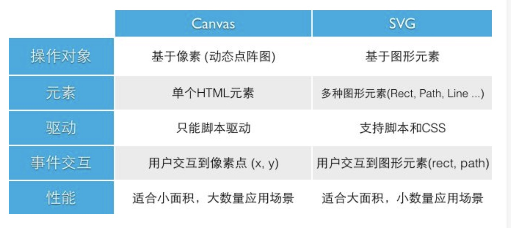

# SVG和Canvas的区别

## 区别
SVG
1.不依赖分辨率
2.支持事件处理器
3.最适合带有大型渲染区域的应用程序（比如谷歌地图）
4.复杂度高会减慢渲染速度（任何过度使用DOM的应用都不快）
5.不适合游戏应用

Canvas
1.依赖分辨率
2.不支持事件绑定
3.弱的文本渲染能力
4.能够以.png和.jpg的格式保存结果图像
5.最适合图像密集的游戏，其中许多对象将会被频繁重绘

## 介绍

### Canvas
Canvas提供的功能更原始，适合像素处理，动态渲染和大数据量绘制

### SVG
SVG功能更完善，适合静态图片展示，高保真文档查看和打印的应用场景

--------

## 介绍

### SVG介绍

SVG（Scable vector Graphics 可缩放矢量图形）
是一种使用XML来描述2D图形的语言；
因为是基于XML，那么svg DOM中的每一个元素都可以，绑定上javascript事件处理器；
在svg中每一个绘制的图形都被视为对象，svg元素的属性发生变化那么浏览器也会重新渲染图形的。

注意：
1、SVG并不属于html5专有内容，在html5之前就有SVG。

2、SVG文件的扩展名是".svg"。

3、SVG绘制的图像在图片质量不下降的情况下被放大。

4、SVG图像经常在网页中制作小图标和一些动态效果图。

### Canvas介绍

Canvas是通过javascript来绘制2D图像的；
Canvas是逐像素进行渲染的；
在Canvas中一旦图形被绘制完成，它就不会得到浏览器的关注，一旦其位置发生变化，那么整个场景需要重新绘制，包括任何已被该图形覆盖了的图形。

使用
canvas使用javascript在网页上绘制图像，本身并没有绘制能力。
canvas是一个矩形区域可以控制其中的每一个元素。
canvas具有多种绘制路径、圆形、矩形、字符以及图像的方法。
下面是典型的常用的绘图方式。

